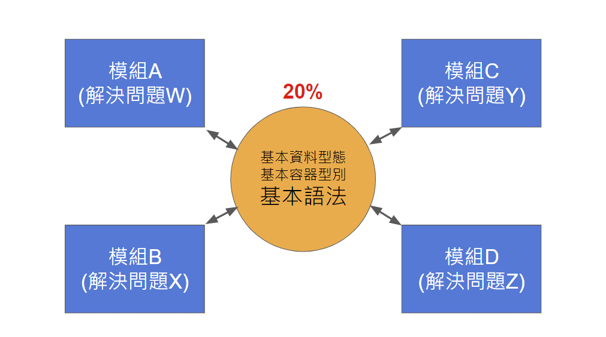
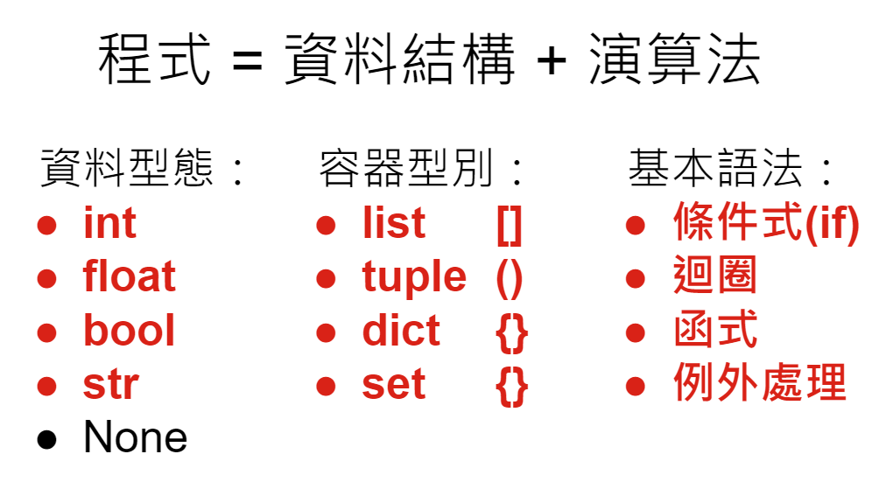

# Python應用於行銷分析

在這個Repo中，我整理了一些課程相關的講義。

## Python簡介

相關連結：

* 投影片：[Python基礎](https://bit.ly/3d5Bd8N)
* 講義：[Python Fundamentals](https://github.com/victorgau/python_fundamentals)
* 練習：[Python Exercises](https://github.com/victorgau/python_exercises)

### 核心觀念 1

### 核心觀念 2

### 核心觀念3

[Python 使用環境](https://ipython.org/ipython-doc/3/development/how_ipython_works.html
)

[Colab](https://colab.research.google.com/) 簡介

## Python 基礎

Python的使用哲學

什麼是模組？什麼是套件？

Python的副檔名 (.py, .ipynb)	
* Python的Hello World… 使用LineNotify！

什麼是變數？

使用[Visualize Python](http://www.pythontutor.com/visualize.html#mode=edit)了解一下變數在記憶體中的狀況。

用 type() 可以看變數裡面有什麼樣的資料！

怎麼寫程式？
* 程式 = 資料結構 + 演算法
* 基本資料型態 (int, float, bool, str)
* 基本容器型別 (list, tuple, dict, set)
* 基本語法 (if statement, loops, functions, exception handling)

怎麼做資料型態轉換？

list的操作：
* indexing
* slicing
* for迴圈

物件導向程式設計(OOP)：

* 物件屬性及方法
* 在物件後面加個點(.)，編輯器通常會提示有那些方法可以用

## 相關連結

本次課程會用到或可能會用到的套件：

* [Pandas](https://pandas.pydata.org/)
* [Scikit-learn](https://scikit-learn.org/stable/)
* [Tensorflow / Keras](https://keras.io/)
* [Statsmodels](https://www.statsmodels.org/stable/index.html)